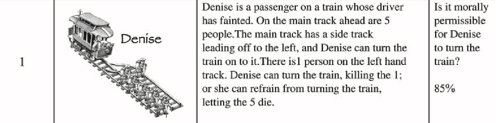
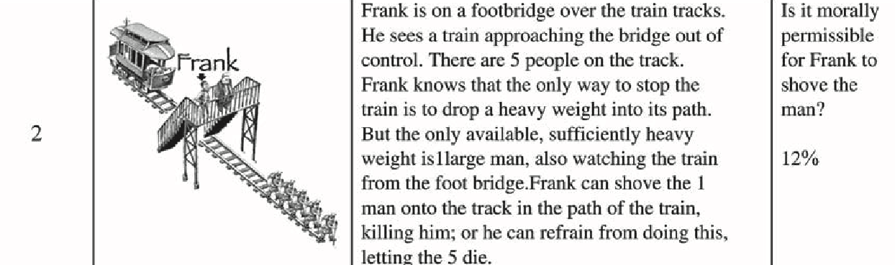
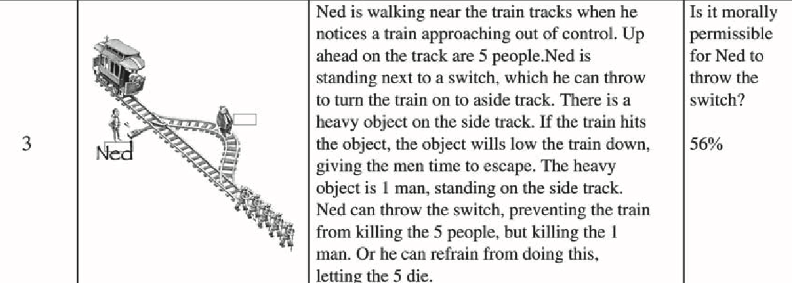
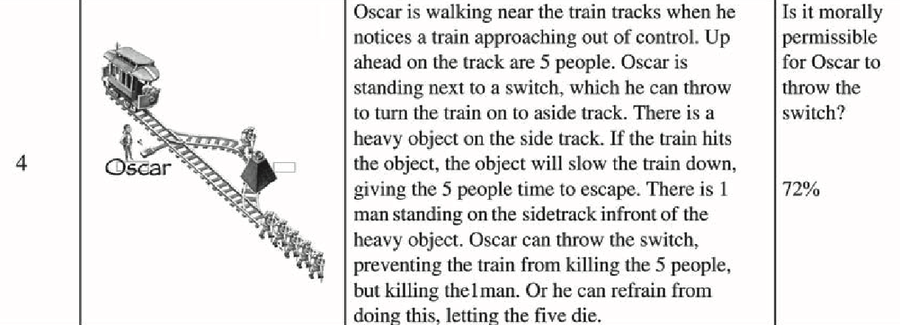

# Two-Sided Fisher's Exact Test

### Study Statistics Summary (Original / Global)

| Study | $N$ | $p$-value | $d$ | $\delta$ | Alternative |
| :--- | :--- | :--- | :--- | :--- | :--- |
| **16. Framing** | 181 / 7228 | 7.4e-7 / 1.01e-50 | 1.08 / 0.40 | 1.96 / 0.72 | Greater |
| **5. Affect & Risk** | 40 / 7218 | 0.0267 / 0.002 | 0.74 / -0.08 | 1.34 / -0.14 | Greater |
| **11. Trolley 1** | 2646 / 6842 | < 0.001 /  2.2e-16 | 2.50 / 1.35 | 4.53 / 2.44 | Two-sided |
| **17. Trolley 2** | 2612 / 7923 | < 0.001 / 4.66e-23 | 0.34 / 0.25 | 0.61 / 0.45 | Greater |

For Framing, there is some problem, I got a p=6.72e-51 for the Global.
Also, the ES in table 2 for original is 1.08 where it's 0.88 in the text.

- By Order: Study questions sequences (we dont care)
- By Site: Different institutes ('uva' or 'uiuc')
- Global: Aggregate all data together

log odds ratio and d
$$
d = \frac{\delta}{\pi / \sqrt{3}} \\
\delta = d \cdot \pi / \sqrt{3}
$$

## [16. Framing decisions (Tversky & Kahneman, 1981) Problem 10](../OSFdata/Framing%20(Tversky%20&%20Kahneman,%201981)/)

**One-sided, Greater**

**$H_0$:** Price of the item does **not** affect travel choice.

**$H_1$:** People travel **more** for the cheaper item.

|           | $30 Item (Vase) | $250 Item (Hanging) | Total |
|-----------|-----------------|---------------------|-------|
| **Yes**   | ya              | yb                  | y1    |
| **No**    | na - ya         | nb - yb             |       |
| **Total** | na              | nb                  | n     |

---

## [5. Affect and Risk (Rottenstreich & Hsee, 2001) Study 1](../OSFdata/Affect%20&%20Risk%20(Rottenstreich%20&%20Hsee,%202001))

**One-sided, Greater**

**$H_0$:** Choice is **independent** of probability level.

**$H_1$:** "Kiss" is preferred **more** at 1% than at 100%.

|           | 1% Chance | 100% Certain | Total |
|-----------|-----------|--------------|-------|
| **Kiss**  | ya        | yb           | y1    |
| **$50**   | na - ya   | nb - yb      |       |
| **Total** | na        | nb           | n     |

**Original Study** (N=40): χ2(1, N=40) = 4.91, p = 0.0267, d = 0.74, $\delta$ = 1.34

**Gloabl Study** (N=7218): p = 0.002, OR = 0.87, d = -0.08, $\delta$ = -0.14

---

## [11. Trolley Dilemma 1 (Hauser et. al. 2007) Scenarios 1+2](../OSFdata/Trolley%20Dilemma%201%20(Hauser%20et%20al.,%202007))

This study compares the **Side Effect** scenario (**Denise**) with the **Greater Good** scenario (**Frank**).

**Sub-analyses (Hauser 1, 2, 3):**
- **Hauser.1**: Includes **all** participants.
- **Hauser.2**: Includes only participants who have **previously heard** of the dilemma.
- **Hauser.3**: Includes only participants who have **never heard** of the dilemma.

**Two-sided**
the sites (different studies) are column `Source.Secondary`

**$H_0$:** Acting is the **same** for Denise vs Frank

**$H_1$:** Acting is **favored** for Denise over Frank.

|           | Denise  | Frank   | Total |
|-----------|---------|---------|-------|
| **Yes**   | ya      | yb      | y1    |
| **No**    | na - ya | nb - yb |       |
| **Total** | na      | nb      | n     |

---

## [17. Trolley Dilemma 2 (Hauser et. al. 2007) Scenarios 3+4](../OSFdata/Trolley%20Dilemma%202%20(Hauser%20et%20al.,%202007))

This study compares the **Oscar** scenario vs the **Ned** scenario.

**Sub-analyses (Hauser 4, 5, 6):**
- **Hauser.4**: Includes **all** participants.
- **Hauser.5**: Includes only participants who have **previously heard** of the dilemma.
- **Hauser.6**: Includes only participants who have **never heard** of the dilemma.

**One-sided, Greater**

**$H_0$:** Acting is the **same** for Oscar vs Ned.

**$H_1$:** Acting is **favored** for Oscar over Ned.

|           | Oscar   | Ned     | Total |
|-----------|---------|---------|-------|
| **Yes**   | ya      | yb      | y1    |
| **No**    | na - ya | nb - yb |       |
| **Total** | na      | nb      | n     |

